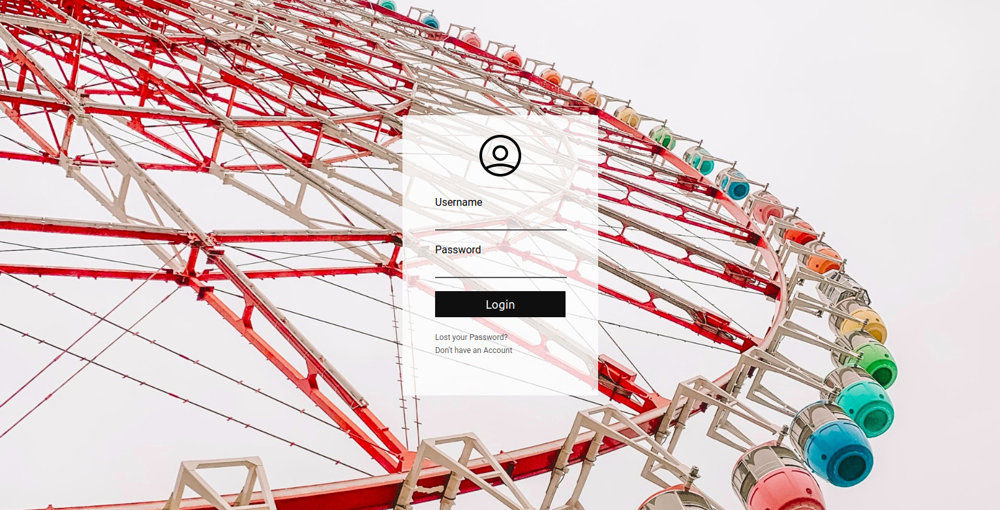

<h1 align="center">
  
  <br>Login System<br>
</h1>

<p align="center">
  <a href="https://github.com/hellowluan/">
    
  </a>
  <a href="https://www.php.net/">
    
  </a>
  <a href="LICENSE">
    
  </a>
</p>

<p align="center">
  <a href="https://www.linkedin.com/in/hellowluan/" target="_blank">
    
  </a>
</p>


<div align="center">
  
</div>


## 🚀 About the project

The objective of this project was to learn the fundamentals of PHP with a MySQL database. Just a simple login system made with procedural php.

## 👷‍♂ Installation

```
// 1 - clone this repository
git clone 

// 2 - move to server
mv project /var/www/html/

// 3 - import database

// 4 - change $dbuser and $dbpassword in config.php

// 5 - to login use admin and admin
```

## 📝 License

This repository was made for study purposes. For more information, read the [LICENSE](LICENSE).

made with ❤ by [Luan Mateus](instagram.com/hellowluan)